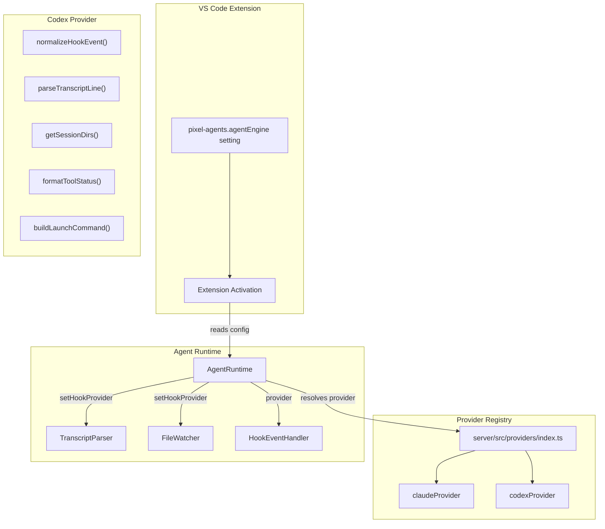
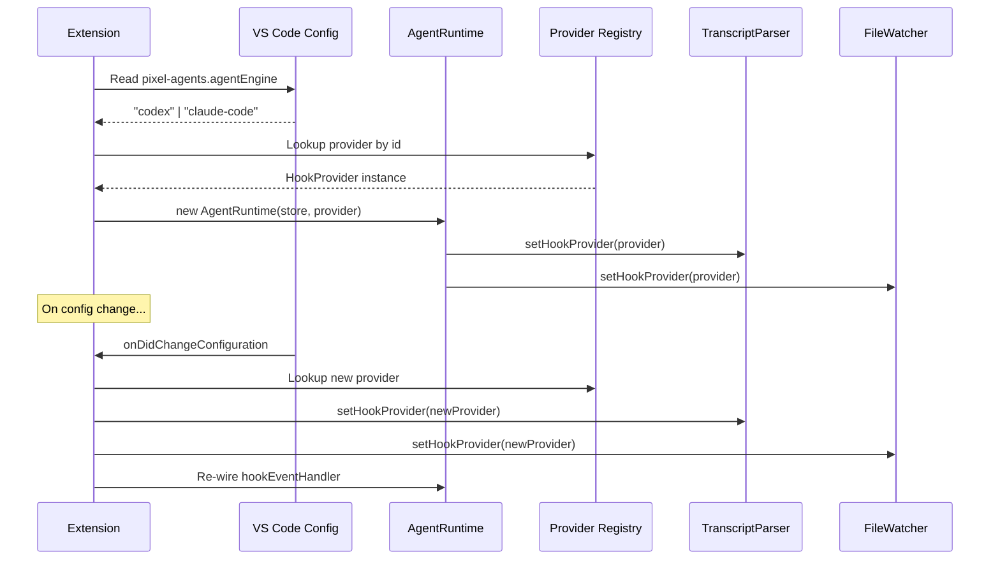

# Design Document: Codex Agent Support

## Overview

This design adds OpenAI Codex CLI as a second `HookProvider` implementation in the Pixel Agents extension. The architecture follows the existing provider pattern established by the Claude provider, introducing a parallel `codex/` directory under `server/src/providers/hook/` and a configuration-driven provider selection mechanism.

The design leverages the fact that Codex CLI exposes a hooks API with an identical contract model to Claude Code (JSON on stdin, events like `PreToolUse`, `PostToolUse`, `Stop`, `SessionStart`, etc.) — differing only in field naming conventions and session storage paths. This makes the `HookProvider` interface a natural fit without modification.

**Key Design Decisions:**

1. **No interface changes** — The existing `HookProvider` interface is sufficient. Codex's hook event model maps directly to the existing `AgentEvent` union type.
2. **Configuration-driven selection** — A single VS Code setting (`pixel-agents.agentEngine`) selects the active provider. The `AgentRuntime` resolves the provider at activation time and re-injects on configuration change.
3. **Hot-swap without reload** — The `setHookProvider` functions already exist on both `transcriptParser.ts` and `fileWatcher.ts`, enabling runtime provider replacement when configuration changes.
4. **Convention over invention** — The Codex provider mirrors the Claude provider's file structure, naming, and export conventions for contributor familiarity.

## Architecture



### Provider Resolution Flow



## Components and Interfaces

### 1. Codex Provider (`server/src/providers/hook/codex/codex.ts`)

The main provider module implementing the `HookProvider` interface:

```typescript
export const codexProvider: HookProvider = {
  kind: 'hook',
  id: 'codex',
  displayName: 'Codex',
  protocolVersion: 1,

  normalizeHookEvent,
  installHooks,
  uninstallHooks,
  areHooksInstalled,

  formatToolStatus,
  permissionExemptTools: new Set([/* codex-specific exempt tools */]),
  subagentToolNames: new Set([/* codex subagent tool names */]),
  readingTools: new Set(['read_file', 'list_directory', 'web_search']),
  terminalNamePrefix: CODEX_TERMINAL_NAME_PREFIX,

  getSessionDirs,
  getAllSessionRoots,
  sessionFilePattern: '*.jsonl',
  parseTranscriptLine,
  buildLaunchCommand,
  // No team provider (Codex doesn't have Agent Teams equivalent yet)
  team: undefined,
};
```

### 2. Codex Constants (`server/src/providers/hook/codex/constants.ts`)

```typescript
export const CODEX_TERMINAL_NAME_PREFIX = 'Codex';
export const CODEX_HOOK_EVENTS = [
  'SessionStart',
  'PreToolUse',
  'PostToolUse',
  'PermissionRequest',
  'Stop',
  'SubagentStart',
  'SubagentStop',
  'UserPromptSubmit',
] as const;
export const CODEX_SESSION_ROOT = '.codex/sessions';
```

### 3. Provider Registry (`server/src/providers/index.ts`)

Updated to export both providers:

```typescript
export { claudeProvider } from './hook/claude/claude.js';
export { codexProvider } from './hook/codex/codex.js';
export { copyHookScript } from './hook/claude/claudeHookInstaller.js';
```

### 4. Configuration Setting (`package.json` contribution)

```json
{
  "pixel-agents.agentEngine": {
    "type": "string",
    "enum": ["claude-code", "codex"],
    "default": "claude-code",
    "description": "Controls which AI coding assistant the extension monitors for agent activity."
  }
}
```

### 5. Extension Activation Changes

The extension activation path reads the configuration value, resolves the provider, and registers a configuration change listener for hot-swapping:

```typescript
// Pseudocode for provider resolution
function resolveProvider(engineValue: string): HookProvider {
  switch (engineValue) {
    case 'codex': return codexProvider;
    case 'claude-code':
    default: return claudeProvider;
  }
}
```

### Key Interface Mappings

| Codex Hook Event | AgentEvent Kind | Notes |
|---|---|---|
| `PreToolUse` | `toolStart` | Uses `tool_use_id` as toolId, `tool_name` as toolName |
| `PostToolUse` | `toolEnd` | Uses sentinel `"current"` toolId (same pattern as Claude) |
| `Stop` | `turnEnd` | Turn completion signal |
| `PermissionRequest` | `permissionRequest` | Permission prompt event |
| `SessionStart` | `sessionStart` | Includes `transcript_path`, `cwd`, `source` |
| `SessionEnd` | `sessionEnd` | Not a documented hook event; inferred from transcript |
| `SubagentStart` | `subagentStart` | Uses `agent_type` as toolName |
| `SubagentStop` | `subagentEnd` | Subagent completion |

### Codex Tools Classification

Based on Codex CLI's documented tool set:

| Category | Tools |
|---|---|
| **Permission Exempt** | (none identified yet — Codex requires approval for most actions) |
| **Subagent Tools** | (subagent spawning tools, if any) |
| **Reading Tools** | File reading, directory listing, web search tools |
| **Writing Tools** | `apply_patch`, `Bash` |

### normalizeHookEvent Implementation

The Codex hook sends JSON on stdin with these common fields: `session_id`, `hook_event_name`, `tool_name`, `tool_use_id`, `tool_input`, `transcript_path`, `cwd`, `model`.

```typescript
function normalizeHookEvent(
  raw: Record<string, unknown>
): { sessionId: string; event: AgentEvent } | null {
  const eventName = raw.hook_event_name;
  const sessionId = raw.session_id;
  if (typeof eventName !== 'string' || typeof sessionId !== 'string') return null;

  switch (eventName) {
    case 'PreToolUse': {
      const toolName = typeof raw.tool_name === 'string' ? raw.tool_name : '';
      const toolInput = (typeof raw.tool_input === 'object' && raw.tool_input !== null)
        ? raw.tool_input as Record<string, unknown>
        : {};
      const toolUseId = typeof raw.tool_use_id === 'string'
        ? raw.tool_use_id
        : `hook-${Date.now()}`;
      return {
        sessionId,
        event: { kind: 'toolStart', toolId: toolUseId, toolName, input: toolInput },
      };
    }
    case 'PostToolUse':
      return { sessionId, event: { kind: 'toolEnd', toolId: 'current' } };
    case 'Stop':
      return { sessionId, event: { kind: 'turnEnd' } };
    case 'PermissionRequest':
      return { sessionId, event: { kind: 'permissionRequest' } };
    case 'SessionStart':
      return {
        sessionId,
        event: {
          kind: 'sessionStart',
          source: typeof raw.source === 'string' ? raw.source : undefined,
          transcriptPath: typeof raw.transcript_path === 'string' ? raw.transcript_path : undefined,
          cwd: typeof raw.cwd === 'string' ? raw.cwd : undefined,
        },
      };
    case 'SubagentStart': {
      const agentType = typeof raw.agent_type === 'string' ? raw.agent_type : 'unknown';
      return {
        sessionId,
        event: {
          kind: 'subagentStart',
          parentToolId: 'current',
          toolId: `hook-sub-${agentType}-${Date.now()}`,
          toolName: agentType,
          input: raw,
        },
      };
    }
    case 'SubagentStop':
      return { sessionId, event: { kind: 'subagentEnd', parentToolId: 'current', toolId: 'current' } };
    case 'UserPromptSubmit':
    default:
      return null;
  }
}
```

### Session Directory Discovery

Codex stores sessions at `~/.codex/sessions/YYYY/MM/DD/` as JSONL files. Unlike Claude (which organizes by project path), Codex uses a date-based hierarchy:

```typescript
function getSessionDirs(workspacePath: string): string[] {
  // Codex sessions are stored globally under ~/.codex/sessions/
  // organized by date. We return the sessions root since the file watcher
  // will use sessionFilePattern to match *.jsonl recursively.
  return [path.join(os.homedir(), '.codex', 'sessions')];
}

function getAllSessionRoots(): string[] {
  return [path.join(os.homedir(), '.codex', 'sessions')];
}
```

### formatToolStatus Implementation

```typescript
function formatToolStatus(toolName: string, input?: unknown): string {
  const inp = (input ?? {}) as Record<string, unknown>;
  const MAX_LEN = 80;
  const truncate = (s: string) =>
    s.length > MAX_LEN ? s.slice(0, MAX_LEN - 3) + '...' : s;

  switch (toolName) {
    case 'apply_patch':
      return truncate('Editing file');
    case 'Bash': {
      const cmd = typeof inp.command === 'string' ? inp.command : '';
      return truncate(`Running: ${cmd}`);
    }
    case 'read_file':
      return truncate(`Reading ${typeof inp.path === 'string' ? path.basename(inp.path) : ''}`);
    case 'list_directory':
      return truncate('Listing directory');
    case 'web_search':
      return truncate('Searching the web');
    default: {
      // MCP tools: mcp__server__tool → "Using tool (server)"
      if (toolName.startsWith('mcp__')) {
        const parts = toolName.split('__');
        const tool = parts[2] || toolName;
        return truncate(`Using ${tool}`);
      }
      return truncate(`Using ${toolName}`);
    }
  }
}
```

## Data Models

### Codex Hook Event Payload (Input on stdin)

All Codex hook events share these common fields:

```typescript
interface CodexHookPayload {
  session_id: string;
  hook_event_name: string;
  transcript_path?: string | null;
  cwd: string;
  model?: string;
  permission_mode?: string;
}
```

Event-specific extensions:

```typescript
interface CodexPreToolUsePayload extends CodexHookPayload {
  hook_event_name: 'PreToolUse';
  tool_name: string;
  tool_use_id: string;
  tool_input: Record<string, unknown>;
  turn_id?: string;
}

interface CodexPostToolUsePayload extends CodexHookPayload {
  hook_event_name: 'PostToolUse';
  tool_name: string;
  tool_use_id: string;
  tool_input: Record<string, unknown>;
  tool_response?: unknown;
  turn_id?: string;
}

interface CodexSessionStartPayload extends CodexHookPayload {
  hook_event_name: 'SessionStart';
  source: 'startup' | 'resume' | 'clear' | 'compact';
}

interface CodexStopPayload extends CodexHookPayload {
  hook_event_name: 'Stop';
  turn_id?: string;
  stop_hook_active?: boolean;
  last_assistant_message?: string | null;
}

interface CodexSubagentStartPayload extends CodexHookPayload {
  hook_event_name: 'SubagentStart';
  agent_id: string;
  agent_type: string;
  turn_id?: string;
}

interface CodexSubagentStopPayload extends CodexHookPayload {
  hook_event_name: 'SubagentStop';
  agent_id: string;
  agent_type: string;
  turn_id?: string;
}
```

### Codex Transcript Line Format

Codex JSONL transcript files use a structure similar to Claude's but with some differences. Each line is a JSON object representing a conversation turn or system event:

```typescript
// Assistant message with tool use
interface CodexAssistantRecord {
  type: 'assistant';
  message: {
    content: Array<
      | { type: 'text'; text: string }
      | { type: 'tool_use'; id: string; name: string; input: Record<string, unknown> }
    >;
    usage?: { input_tokens: number; output_tokens: number };
  };
}

// User message with tool results
interface CodexUserRecord {
  type: 'user';
  message: {
    content: Array<
      | { type: 'text'; text: string }
      | { type: 'tool_result'; tool_use_id: string; content: unknown }
    >;
  };
}

// System record (turn boundaries, etc.)
interface CodexSystemRecord {
  type: 'system';
  subtype?: 'turn_duration' | string;
}
```

### Configuration Model

```typescript
// VS Code setting contribution
interface AgentEngineConfig {
  'pixel-agents.agentEngine': 'claude-code' | 'codex';
}
```

### Provider Resolution Map

```typescript
const PROVIDER_MAP: Record<string, HookProvider> = {
  'claude-code': claudeProvider,
  'codex': codexProvider,
};
```


## Correctness Properties

*A property is a characteristic or behavior that should hold true across all valid executions of a system — essentially, a formal statement about what the system should do. Properties serve as the bridge between human-readable specifications and machine-verifiable correctness guarantees.*

### Property 1: Hook event normalization produces correct event kinds or null

*For any* raw Codex hook event payload, if the payload contains both a string `session_id` and a string `hook_event_name` that matches a recognized Codex event name, then `normalizeHookEvent` SHALL return a non-null result with the correct `AgentEvent` kind corresponding to that event name. *For any* payload missing either field (or where either is not a string), or containing an unrecognized event name, the function SHALL return null without throwing.

**Validates: Requirements 1.2, 6.1, 6.2, 6.3, 6.4, 6.5, 6.6**

### Property 2: formatToolStatus output never exceeds 80 characters

*For any* tool name string and any input object (regardless of the string lengths of values within), `formatToolStatus` SHALL return a string whose length is at most 80 characters. When truncation occurs, the result ends with '...' and the total length is exactly 80 characters.

**Validates: Requirements 1.3**

### Property 3: Transcript line parsing round-trip correctness

*For any* valid Codex transcript JSON line containing assistant `tool_use` blocks, `parseTranscriptLine` SHALL return a `toolStart` AgentEvent for each block with a unique `toolId` matching the block's `id`, the block's `name` as `toolName`, and the block's `input` as `input`. *For any* valid transcript JSON line containing user `tool_result` blocks, it SHALL return a `toolEnd` AgentEvent with `toolId` equal to the `tool_use_id`. *For any* string that is not valid JSON or contains an unrecognized record type, `parseTranscriptLine` SHALL return null without throwing an exception.

**Validates: Requirements 1.7, 5.1, 5.2, 5.6, 5.7, 5.8**

### Property 4: Provider resolution always returns a valid HookProvider

*For any* string value passed to the provider resolution function, it SHALL always return a valid `HookProvider` instance (never null/undefined). When the value is "codex", it returns `codexProvider`. When the value is "claude-code", it returns `claudeProvider`. *For any* other string value, it returns `claudeProvider` as a fallback.

**Validates: Requirements 3.4, 3.5, 3.7, 4.4**

### Property 5: buildLaunchCommand structure correctness

*For any* session ID string and cwd string, `buildLaunchCommand` SHALL return an object with a non-empty `command` string and an `args` array containing the session ID. When `bypassPermissions` is true, the args array SHALL contain the bypass flag. When `bypassPermissions` is false or undefined, the bypass flag SHALL NOT appear in args.

**Validates: Requirements 1.6**

### Property 6: getSessionDirs returns a well-formed path for any workspace

*For any* workspace path string (including empty string, paths with special characters, and non-existent paths), `getSessionDirs` SHALL return a non-empty array containing at least one path string under the user's home directory without throwing an exception.

**Validates: Requirements 1.5, 2.1, 2.5**

## Error Handling

### Hook Event Normalization Errors

| Scenario | Behavior |
|---|---|
| Missing `session_id` or `hook_event_name` | Return `null` silently |
| Non-string `session_id` or `hook_event_name` | Return `null` silently |
| Unrecognized event name | Return `null` silently |
| Missing optional fields (`tool_name`, `tool_input`) | Use defaults (empty string, empty object) |

### Transcript Parsing Errors

| Scenario | Behavior |
|---|---|
| Malformed JSON line | Return `null`, log at debug level |
| Unrecognized record type | Return `null`, log at debug level |
| Missing `message.content` field | Return `null` silently |
| Tool_use block missing `id` or `name` | Skip the block, continue processing others |

### Session Directory Errors

| Scenario | Behavior |
|---|---|
| Session directory doesn't exist | Return expected path in array (caller tolerates missing dirs) |
| Permission denied reading directory | File watcher skips directory, logs warning, no unhandled error |
| Invalid workspace path | Return a best-effort computed path without throwing |

### Configuration Errors

| Scenario | Behavior |
|---|---|
| Invalid `agentEngine` value | Fall back to `claudeProvider`, log warning with the invalid value |
| Configuration read failure | Fall back to `claudeProvider` |

### Hook Installation Errors

| Scenario | Behavior |
|---|---|
| `~/.codex` directory doesn't exist | Create it, or report installation failure gracefully |
| `hooks.json` is malformed | Log error, report hooks not installed |
| Write permission denied | Report installation failure with descriptive message |

## Testing Strategy

### Unit Tests (Vitest)

Unit tests verify specific examples and edge cases using the existing Vitest setup in `server/`:

- **Provider identity**: Verify `codexProvider` has correct `kind`, `id`, `displayName`, `protocolVersion`
- **Tool classifications**: Verify `permissionExemptTools`, `subagentToolNames`, `readingTools` contain expected values
- **normalizeHookEvent examples**: Test each recognized event type with realistic payloads
- **formatToolStatus examples**: Test each known tool name with realistic inputs
- **parseTranscriptLine examples**: Test specific transcript line formats
- **buildLaunchCommand examples**: Test with/without bypass permissions
- **getSessionDirs examples**: Test with typical workspace paths
- **Provider registry**: Verify both providers are exported from index.ts
- **Configuration resolution**: Test the provider resolution function with valid and invalid values

### Property-Based Tests (fast-check + Vitest)

Property-based tests verify universal invariants across randomly generated inputs. Each test runs a minimum of 100 iterations.

- **Library**: `fast-check` (standard PBT library for TypeScript/Vitest projects)
- **Location**: `server/__tests__/codex.property.test.ts`
- **Configuration**: `fc.assert(fc.property(...), { numRuns: 100 })`

Tests correspond to the Correctness Properties above:

1. **Hook event normalization** — Generate random payloads with varying field presence/types, verify correct AgentEvent kind mapping or null return
2. **formatToolStatus length** — Generate random tool names (including very long strings) and input objects with long values, verify output ≤ 80 chars
3. **Transcript parsing** — Generate random valid/invalid JSON lines, verify correct event extraction or null return without exceptions
4. **Provider resolution** — Generate random strings, verify always returns a valid HookProvider (codexProvider for "codex", claudeProvider otherwise)
5. **buildLaunchCommand** — Generate random sessionIds, cwds, and boolean bypass flags, verify structure invariants
6. **getSessionDirs** — Generate random path strings, verify non-empty array return without throwing

Each property test is tagged:
```typescript
// Feature: codex-agent-support, Property 1: Hook event normalization produces correct event kinds or null
```

### Integration Tests

Integration tests verify cross-component behavior:

- **Hot-swap**: Simulate configuration change and verify provider re-injection
- **File detection**: Verify file watcher detects new JSONL files in Codex session directories
- **End-to-end hook flow**: POST a hook event to the HTTP server and verify the agent state updates

### Test File Structure

```
server/__tests__/
  codex.test.ts              # Unit tests (mirrors claude.test.ts)
  codex.property.test.ts     # Property-based tests
```
